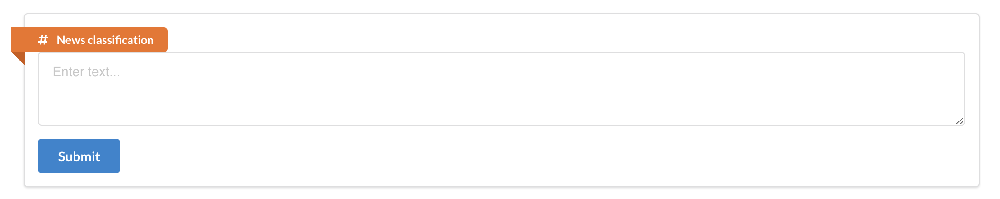
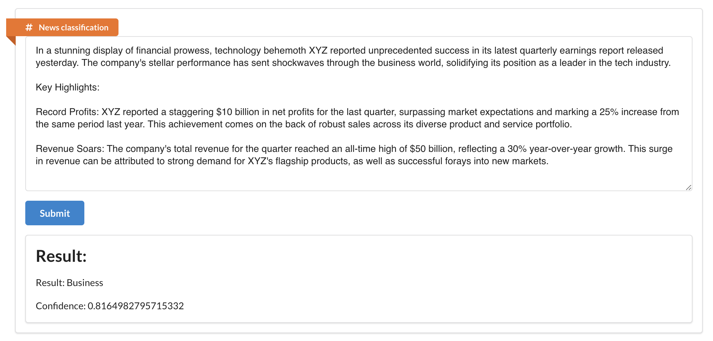
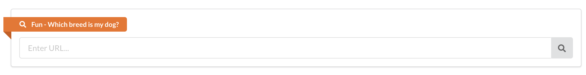
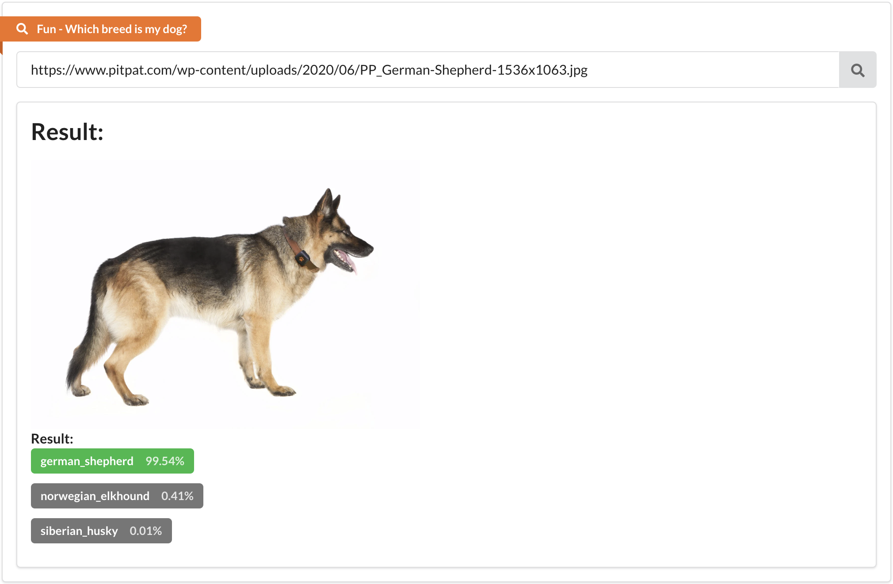

# Introduction

This is the client for my two projects that I did in a course of my early year in master's degree. The project contains two small fun apps:
- **News classification**: This app is used to classify news into 4 categories: business, entertainment, politics, sport and tech.
- **Dog breed classification**: This app is used to classify dog breeds into 120 breeds.

# How to run
> :warning: This need a server to run. Please refer to [this repo](https://levulinhbk@bitbucket.org/levulinhbk/soc-term-project-dl-service.git/src)

Just like every other React app, you can run this app by:
```
npm start
```

# About the project
This project is built with React and Redux. The project is built with the help of *create-react-app*. The client connects to endpoints from a Flask server. The server serves the model in a naive manner, which is not recommended for production. However, for the purpose of this project, it is sufficient.

# Demo
Live demo: https://what-the-dog.onrender.com/
## News classification



## Dog breed classification


